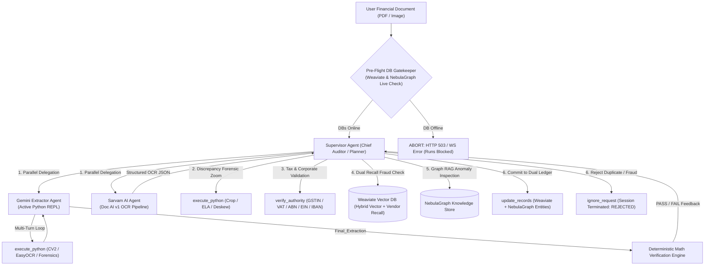

When businesses try to process financial documents like invoices, receipts, and bank statements using standard AI models, they run into a major roadblock: single-pass AI is prone to subtle errors and hallucinations. A normal language model might look at a blurry or complex invoice and easily mistake an 8 for a B, miss a line item, or fail to notice that the math does not add up. In finance and accounting, even a single missed digit or miscalculated tax amount can lead to serious compliance failures, incorrect payouts, and financial loss.

To solve this, we designed a system that mimics how an elite accounting team works in real life. Instead of relying on one AI model to do everything in a single guess, the workload is divided between specialized AI agents. One agent acts as a hands-on visual investigator that carefully reads and extracts every detail from the document, while a senior supervisor agent acts as a strict auditor. The supervisor oversees the entire process, directs the investigator to double-check hard-to-read sections, and ensures that no document is ever approved without thorough scrutiny.

Most conventional AI tools treat a document as a flat, static picture. Our visual extraction agent treats the document like an active visual investigation. If a section of an invoice is blurry, faded, crooked, or written by hand, the agent does not guess. It actively zooms into that specific region, straightens tilted text, enhances the contrast, and re-reads the difficult numbers until it is completely confident. By isolating individual tables and zooming into totals, it captures every line item with remarkable precision.

Once the numbers are extracted, the system does not simply accept them at face value. It automatically runs rigorous checks to confirm that all individual line items add up to the subtotal, that taxes are calculated correctly, and that the grand total matches the math. Additionally, the system checks the vendor's tax registration and banking information against official business registries to confirm the company is a real, active entity and not a shell company or an impostor using someone else's credentials.

A critical reason for this architecture is fraud prevention. Standard database systems only check if an invoice number has been seen before, which means fraudsters can easily resubmit the same receipt with an altered invoice number or submit repetitive fake bills. Our system creates an intelligent fingerprint of every document by analyzing the vendor name, the exact item list, and the semantic meaning of the bill. It compares incoming documents against historical records to instantly detect duplicate submissions, copy-pasted templates, and suspicious billing patterns.

The supervisor agent pulls all of these pieces together before anything touches the company ledger. If two different extraction methods disagree on a price or quantity, the supervisor steps in to review the evidence and verify the disputed area. It examines the fraud risk score, verifies that the tax math balances, and decides whether the document is a legitimate expense, a routine monthly subscription, or a fraudulent submission that should be rejected on the spot.

The end result is an autonomous financial pipeline that delivers true peace of mind. By combining active visual investigation, deterministic mathematical proof, government registry verification, and historical fraud memory, the system eliminates manual data entry while dramatically reducing the risk of billing fraud. Organizations get fast, transparent, and rock-solid document processing that they can genuinely trust with their balance sheets.

---

# Technical Architecture & Implementation Specification

## 1. System Architecture & Multi-Agent Orchestration

The platform is engineered on a **Decoupled Auditor-Worker Multi-Agent Architecture** built on **LangGraph**. The workflow enforces strict separation of concerns between extraction, auditing, authority verification, and ledger persistence:



---

## 2. The Supervisor Agent (Chief Auditor)

### Role & Operating Philosophy
The **Supervisor Agent** functions as the **Senior Financial Auditor**.
* **Zero Trust Assumption**: Initial OCR and model extractions are treated as unverified hypotheses.
* **Deterministic Boundary**: The supervisor is programmatically forbidden from approving any record without verified arithmetic, validated authority identifiers, and vector/graph fraud clearance.
* **Non-Worker Execution**: The supervisor does not perform bulk data entry; it coordinates workers, inspects edge cases, resolves cross-agent discrepancies, and signs off on ledger writes.

### Supervisor Toolset

| Tool Name | Arguments | Capabilities & Execution Flow | Output & Error Handling |
| :--- | :--- | :--- | :--- |
| **`delegate_extraction`** | `doc_type`, `instructions`, `target_agents` | Dispatches extraction jobs in parallel to **Gemini Extractor** and **Sarvam Doc AI**. | Results are injected into state as a unified comparison payload for cross-agent reconciliation. |
| **`execute_python`** | `code`, `view_images`, `reset_state` | Forensic visual analysis when Gemini and Sarvam return conflicting figures (e.g. Total is `₹392.80` vs `₹393.00`). | Captures stdout/stderr, attaches up to 5 visual crops as multi-modal vision inputs, with a global 5,000 token limit. |
| **`verify_authority`** | `identifier`, `doc_type_or_country` | Validates corporate tax registration IDs (GSTIN, VAT, ABN, EIN) and bank accounts (IBAN) using **Modulo checksums** and **live government registries** (Sandbox.co.in, EU VIES, UK HMRC, ABR). | Returns entity type, state/country decoding, checksum validity, and live registry status. |
| **`check_fraud_vectors`** | `data` | Executes dual-recall hybrid vector similarity search and exact vendor recall in **Weaviate**, followed by Graph RAG entity inspection in **NebulaGraph**. | Returns risk score (`0.0`–`1.0`), match type (`DUPLICATE`, `TEMPLATE_FRAUD`, `HIGH_SEMANTIC_SIMILARITY`), and candidate UUIDs. |
| **`inspect_past_records`** | `record_ids` | RAG retrieval tool fetching full historical invoice payloads from **NebulaGraph / Weaviate** to investigate suspected duplicate submissions. | Returns complete historical line items, invoice numbers, timestamps, and audit trails. |
| **`update_records`** | `data`, `entities` | Final commitment tool. Persists validated financial data into **Weaviate** and builds knowledge graph relationships in **NebulaGraph** (`:Invoice`, `:Vendor`, `:TaxID`, `:LineItem`, `:Entity`). | Terminates session with `status: "COMMITTED"`. |
| **`ignore_request`** | `reason` | Rejects the document if it is non-financial spam, corrupted, or confirmed duplicate/template fraud. | Terminates session with `status: "REJECTED"`. |

### Strict Security Invariant
* **Hard Enforcement Gate**: The Supervisor is **programmatically prevented** from calling `update_records` without first calling `check_fraud_vectors`. An attempt to commit without prior fraud inspection triggers an immediate security exception.

---

## 3. The Extractor Agent (Active Visual Forensics)

### Role & Capabilities
The **Gemini Extractor Agent** is an **Active Visual Forensic Investigator**. Unlike traditional static single-pass OCR, it actively executes Python code in a stateful environment to isolate, crop, deskew, and inspect high-density visual segments.

```
+-----------------------------------------------------------------------------------+
|                           Stateful Python REPL Environment                        |
|                                                                                   |
|  Pre-Warmed Libraries: OpenCV (cv2), NumPy, Pandas, PIL, EasyOCR, PyPDF, pdfplumber|
|                                                                                   |
|  Forensic Suite:                                                                  |
|  - forensics.deskew(image)           -> Auto-detects & corrects tilted scans       |
|  - forensics.ela(image)              -> Error Level Analysis for digital tampering |
|  - forensics.extract_table_grid(img) -> Identifies table lines & cell coordinates  |
|  - forensics.normalize_currency(str) -> Normalizes non-decimal £/s/d, Lakhs/Crores |
|                                                                                   |
|  Execution Workspace: backend/outputs/ (Zero /tmp duplication, instant 200 OK URL)|
+-----------------------------------------------------------------------------------+
```

### Extractor Toolset

| Tool Name | Arguments | Capabilities & Features |
| :--- | :--- | :--- |
| **`execute_python`** | `code`, `view_images`, `reset_state` | Executes Python code in a persistent namespace where variables (`img`, `crops`, `df`), imports, and file states remain resident across turns. Up to 5 image crops are attached as native multi-modal vision inputs. |
| **`Final_Extraction`** | `data` | Submits structured JSON payload to the **Deterministic Verification Engine** for automated arithmetic proof before returning to the Supervisor. |

---

## 4. Sarvam AI Agent (Doc AI OCR Pipeline)

* **Architecture**: Direct integration with the official Sarvam Doc AI v1 asynchronous job engine (`https://api.sarvam.ai/doc-ai/v1`).
* **Resilience & Polling**:
  * **Asynchronous Lifecycle**: Submits document to `/job/extract`, receives `job_id`, and polls `/job/{job_id}/status` until `completed` status before retrieving results from `/job/{job_id}/results`.
  * **Extended Polling Ceiling**: Configured with a `max_wait = 300s` (5 minutes) timeout and 3-second polling intervals to handle peak cloud queue loads.
  * **Transient Network Retry**: Implements an automatic 3-attempt retry loop with exponential backoff on socket connection errors and write timeouts.

---

## 5. Deterministic Mathematical Verification Engine

The verification engine validates structured payloads against real-world accounting rules without LLM intervention:

### 1. Dual-Mode Arithmetic Proof
* **B2B Invoices (Tax-Exclusive / Standard)**:
  $$\sum_{i=1}^{n} \text{line\_items}[i].\text{row\_total} \approx \text{Subtotal}$$
  $$\text{Subtotal} + \text{Tax Amount} = \text{Total Amount}$$
* **Retail / B2C Receipts (Tax-Inclusive / MRP)**:
  $$\sum_{i=1}^{n} \text{line\_items}[i].\text{row\_total} \approx \text{Total Amount}$$
  $$\text{Subtotal} + \text{Tax Amount} = \text{Total Amount}$$

### 2. Tolerances & Adjustments
* **Floating-Point Precision**: $\pm 0.05$ decimal tolerance for rounding errors.
* **Cash Round-Off Adjustments**: $\pm 1.05$ tolerance to accommodate statutory retail cash round-offs (e.g. `₹392.80` rounded to `₹393.00`).

---

## 6. Multi-Country Government Authority Verification

The `verify_authority` subsystem connects Modulo check digit mathematics with live REST registry lookups:

| Country / Standard | Supported Identifiers | Mathematical Checksum Algorithm | Live Government / Public Registry Endpoint |
| :--- | :--- | :--- | :--- |
| **India** | GSTIN, PAN | Modulo-36 check digit algorithm; State Code (01–38) & Entity Type (C, P, F) parsing | Sandbox.co.in GSTN Gateway API (`SANDBOX_API_KEY`) |
| **United Kingdom** | UK VAT (9 digits) | Modulo-97 check digit (weights 8 to 2) | UK HMRC VAT API (`api.service.hmrc.gov.uk`) |
| **European Union** | EU VAT / VIES (27 states) | Country-specific Modulo-97/11 checksums | EU Commission VIES REST API (`ec.europa.eu/taxation_customs/vies`) |
| **Australia** | ABN (11 digits) | Modulo-89 weighted sum check ($(\sum w_i d_i) \pmod{89} \equiv 0$) | Australian Business Register (ABR) API (`abr.business.gov.au`) |
| **United States** | US EIN (9 digits) | 2-digit IRS campus prefix mapping ($10\text{--}99$) | US SEC EDGAR Company Database (`sec.gov/cgi-bin/browse-edgar`) |
| **International** | IBAN (Up to 34 chars) | ISO 7064 Modulo 97-10 check ($S \pmod{97} \equiv 1$) | Format validation & routing code decode |

---

## 7. Fraud Detection Engine: Vector Similarity & Graph RAG

### 1. Dual-Recall Vector Search (Weaviate)
Standard vector queries alone can miss exact invoice duplicates if the corpus contains many visually identical receipts from other locations. The dual-recall engine executes:
1. **Semantic Vector Search**: `near_text` query using 384-dimensional dense vectors (`sentence-transformers/multi-qa-MiniLM-L6-cos-v1`).
2. **Vendor-Level Record Recall**: Exact vendor property lookup (`fetch_objects(vendor_name)`) retrieving all historical invoices under that supplier.

### 2. Fraud Classification Rules
* **Rule 1: Exact Duplicate Invoice Number (CRITICAL RISK)**:
  $$\text{Invoice Number}_{\text{current}} = \text{Invoice Number}_{\text{past}} \implies \text{CRITICAL DUPLICATE}$$
  *Triggers immediate `risk_level: "CRITICAL"`, flagging confirmed duplicate submission.*
* **Rule 2: Template Fraud / Shared Basket (HIGH RISK)**:
  $$\text{Amount}_{\text{current}} = \text{Amount}_{\text{past}} \land (\text{Fingerprint Match} \lor \text{Similarity} \ge 0.75) \implies \text{TEMPLATE FRAUD}$$
  *Identifies copy-pasted line item baskets submitted under altered invoice numbers.*
* **Rule 3: Semantic Anomaly (MEDIUM RISK)**:
  $$\text{Similarity Score} \ge 0.85 \implies \text{HIGH SEMANTIC SIMILARITY}$$

### 3. Knowledge Graph Entity Correlation (NebulaGraph RAG)
Queries graph traversals to uncover collusion patterns:
* **Cross-Vendor Entities**: Detects if a person, bank account, or project is shared across ostensibly competing vendors.
* **Multi-Invoice Clustering**: Flags spikes where an individual or reference appears on dozens of unrelated invoices within a short timeframe.

---

## 8. Dual Database Storage & Pre-Flight Gatekeeper

```
+-----------------------------------------------------------------------------------+
|                           Dual Database Persistence Layer                         |
|                                                                                   |
|  1. Weaviate Vector Store (Port 8080)                                             |
|     - Class: FinancialRecord                                                      |
|     - Dense Vectors: 384 dimensions (multi-qa-MiniLM-L6-cos-v1)                   |
|     - Metric: Cosine Distance                                                     |
|     - Indexed Properties: summary_text, vendor_name, total_amount, invoice_date,  |
|                           line_item_fingerprint, full_json_blob                   |
|                                                                                   |
|  2. NebulaGraph Knowledge Store (Port 9669)                                       |
|     - Space: financial_records                                                    |
|     - Vertices: :Invoice, :Vendor, :TaxID, :LineItem, :Person, :Project,          |
|                 :Department, :Reference                                          |
|     - Edges: :ISSUED_BY, :CONTAINS_ITEM, :FOR_PROJECT, :ATTENTION_OF,             |
|              :FROM_DEPARTMENT, :REFERENCES                                        |
+-----------------------------------------------------------------------------------+
```

### Pre-Flight Enforcement (Zero Degraded Runs)
* **Hard Block on Run Start**: Both WebSocket and REST execution pipelines verify database readiness before launching agent execution. If either Weaviate or NebulaGraph is offline, the run is rejected with HTTP 503 / WebSocket error.
* **Elimination of Fallbacks**: Removed all silent fallback blocks that previously defaulted to `"LOW"` risk on DB errors. Database errors immediately return `DATABASE_OFFLINE` error payloads.

---

## 9. Operational Guardrails & Data Distillation

1. **Global 5,000 Token Output Ceiling (`tiktoken`)**:
   - All tool responses pass through OpenAI's `cl100k_base` tokenizer.
   - Outputs exceeding 5,000 tokens are truncated with actionable guidance for the agent to redirect output to disk and inspect with Python.
2. **Scoped Provenance & Metadata**:
   - EXIF/PDF metadata is extracted exclusively during the supervisor's initial document intake turn. It is never re-run for intermediate crops or sub-agent loops.
3. **Pristine JSONL Trajectory Distillation (`distillation/{trace_id}/`)**:
   - Every completed run (both **Committed** and **Rejected**) records token-by-token trajectory logs (`SupervisorAgent.jsonl`, `ExtractorAgent.jsonl`, `SarvamDocAI.jsonl`, and `metadata.json`).
   - Strips raw base64 binary chunks and internal thought signatures, producing lightweight, production-ready dataset artifacts for SFT and DPO model fine-tuning.
4. **Log Cleanliness**:
   - Suppressed verbose `uvicorn.access` HTTP asset polling logs (`GET /outputs/... 200 OK`), ensuring a clean CLI interface and developer experience.
